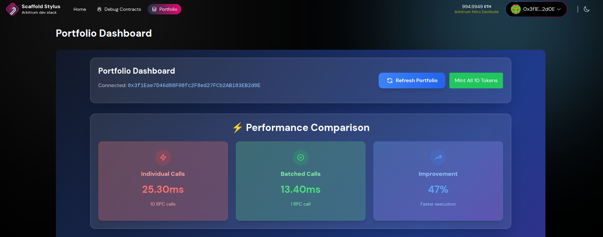

### Portfolio Dashboard - Multi-Token Balance Reader

#### Overview
A comprehensive demonstration of efficient multi-contract reading patterns built on Arbitrum Stylus. This feature showcases the performance benefits of batched contract calls versus individual RPC requests when managing a diverse token portfolio.

#### Screenshots

#### Challenge

**🟢 Challenge 001: Multi-Read Dashboard [Frontend Only]**

**Goal:** Build a portfolio dashboard that efficiently reads from multiple contracts

**Requirements:**
- Display balances from 3+ different tokens
- Show total portfolio value in USD  
- Implement batched reads vs individual calls comparison
- Basic refresh mechanism

**Smart Contract Task (Optional):**
- Create a simple PortfolioReader.rs contract that aggregates multiple token balances in a single call
- Extend the existing YourContract with view functions for batch reading

**Optimization Focus:** RPC call reduction, batching patterns

#### Implementation Phases

##### Phase 1: Mock Token Infrastructure
**Problem:** No existing tokens available on testnet for meaningful portfolio demonstration

**Solution:** Created MockToken.rs contract with full ERC20 compatibility
- Implemented standard ERC20 functions (balanceOf, name, symbol, mint)
- Deployed 10 different mock tokens representing popular DeFi assets
- Pre-funded test accounts with realistic token distributions
- Enabled on-demand minting for flexible testing scenarios

##### Phase 2: Batch Reading Optimization
**Problem:** Reading from 10 tokens individually creates 10+ RPC calls

**Solution:** Built PortfolioReader.rs aggregation contract
- Single contract call retrieves all token balances simultaneously
- Implements external contract calls using Stylus `sol_interface!` pattern

#### Performance Benefits
- **Individual Calls:** 10 separate RPC requests
- **Batched Calls:** 1 aggregated RPC request
- **Result:** Significant reduction in network latency and improved user experience